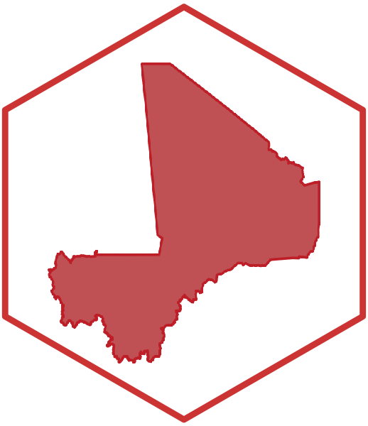

<!-- README.md is generated from README.Rmd. Please edit that file -->

```{r setup, include = FALSE}
knitr::opts_chunk$set(
  collapse = TRUE,
  comment = "#>",
  fig.path = "man/figures/README-",
  out.width = "100%"
)

require(rgdal)
require(rgeos)
require(raster)
```
# mali: Datasets for Use in Designing Surveys in Mali 

[](https://www.repostatus.org/#active)
[](https://www.tidyverse.org/lifecycle/#maturing)
[](https://travis-ci.org/validmeasures/mali)
[](https://ci.appveyor.com/project/validmeasures/mali)

Designing surveys require relevant datasets to be used as basis for sample size calculations, sampling design, survey planning/logistics and survey implementation. These include datasets on population, lists of sampling clusters, map datasets for spatial sampling, and previous survey datasets that can be used for estimating indicator variance and design effects. This package contains relevant datasets for use in designing surveys in Mali

## Installation

`mali` is not yet released on [CRAN](https://cran.r-project.org).

You can install the development version of `mali` from [GitHub](https://github.com/validmeasures/mali) with:

```{r install, echo = TRUE, eval = FALSE}
if(!require(devtools)) install.packages("devtools") 
install_github("validmeasures/mali")
```

## Usage

### Accessing Mali map data

The following packages will be required when accessing and manipulating map data available from the `mali` package.

```{r pacakges, echo = TRUE, eval = FALSE}
require(rgdal)
require(rgeos)
require(raster)
```

#### Country borders

To access country borders, use the following command:

```{r country, echo = TRUE, eval = TRUE}
mali::mli0
```

The output provides overview information on the features included in the country borders map and the variables included in the country map data. This is a summary output for a `SpatialPolygonsDataFrame`.

To plot the country borders, the `plot()` function from the `sp` package can be used as follows:

```{r country-plot, echo = TRUE, eval = TRUE}
plot(mali::mli0)
```

#### Region borders

To access region borders, use the following command:

```{r region, echo = TRUE, eval = TRUE}
mali::mli1
```

The output provides overview information on the features included in the region borders map and the variables included in the region map data. This is a summary output for a `SpatialPolygonsDataFrame`.

To plot the region borders, the `plot()` function from the `sp` package can be used as follows:

```{r region-plot, echo = TRUE, eval = TRUE}
plot(mali::mli1)
```

#### Cercle borders

To access cercle borders, use the following command:

```{r cercle, echo = TRUE, eval = TRUE}
mali::mli2
```

The output provides overview information on the features included in the cercle borders map and the variables included in the cercle map data. This is a summary output for a `SpatialPolygonsDataFrame`.

To plot the cercle borders, the `plot()` function from the `sp` package can be used as follows:

```{r cercle-plot, echo = TRUE, eval = TRUE}
plot(mali::mli2)
```

#### Commune borders

To access commune borders, use the following command:

```{r commune, echo = TRUE, eval = TRUE}
mali::mli3
```

The output provides overview information on the features included in the commune borders map and the variables included in the commune map data. This is a summary output for a `SpatialPolygonsDataFrame`.

To plot the commune borders, the `plot()` function from the `sp` package can be used as follows:

```{r commune-plot, echo = TRUE, eval = TRUE}
plot(mali::mli3)
```

#### Bamako borders

To access Bamako borders, use the following command:

```{r bamako, echo = TRUE, eval = TRUE}
mali::bamako
```

The output provides overview information on the features included in the bamako borders map and the variables included in the bamako map data. This is a summary output for a `SpatialPolygonsDataFrame`.

To plot the bamako borders, the `plot()` function from the `sp` package can be used as follows:

```{r bamako-plot, echo = TRUE, eval = TRUE}
plot(mali::bamako)
```
