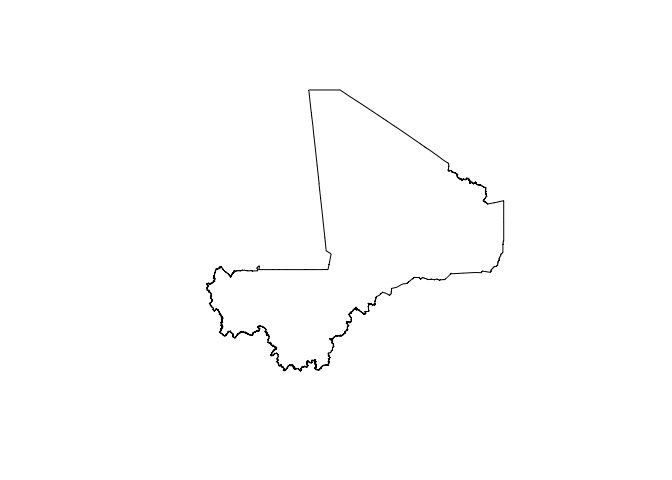
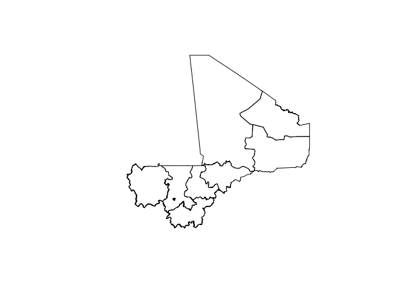
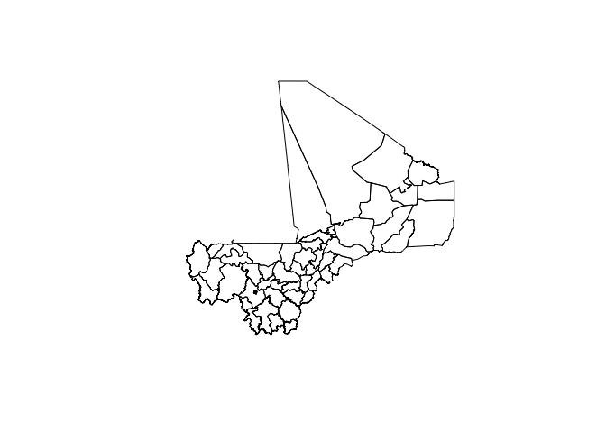
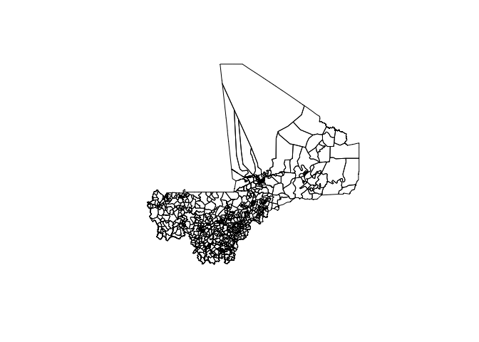
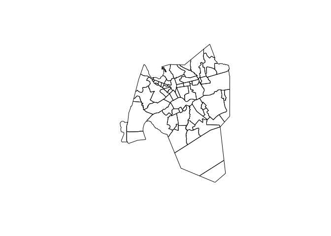

<!-- README.md is generated from README.Rmd. Please edit that file -->

# mali: Datasets for Use in Designing Surveys in Mali 

[](https://www.repostatus.org/#active)
[](https://www.tidyverse.org/lifecycle/#maturing)
[](https://travis-ci.org/validmeasures/mali)
[](https://ci.appveyor.com/project/validmeasures/mali)

Designing surveys require relevant datasets to be used as basis for
sample size calculations, sampling design, survey planning/logistics and
survey implementation. These include datasets on population, lists of
sampling clusters, map datasets for spatial sampling, and previous
survey datasets that can be used for estimating indicator variance and
design effects. This package contains relevant datasets for use in
designing surveys in Mali

## Installation

`mali` is not yet released on [CRAN](https://cran.r-project.org).

You can install the development version of `mali` from
[GitHub](https://github.com/validmeasures/mali) with:

``` r
if(!require(devtools)) install.packages("devtools") 
install_github("validmeasures/mali")
```

## Usage

### Accessing Mali map data

The following packages will be required when accessing and manipulating
map data available from the `mali` package.

``` r
require(rgdal)
require(rgeos)
require(raster)
```

#### Country borders

To access country borders, use the following command:

``` r
mali::mli0
#> class       : SpatialPolygonsDataFrame 
#> features    : 1 
#> extent      : -12.23924, 4.24467, 10.14137, 24.99951  (xmin, xmax, ymin, ymax)
#> coord. ref. : +proj=longlat +datum=WGS84 +no_defs +ellps=WGS84 +towgs84=0,0,0 
#> variables   : 11
#> names       : OBJECTID_1, admin0Name, admin0Pcod, admin0RefN, admin0AltN, admin0Al_1,       date,    validOn, validTo, Shape_Leng, Shape_Area 
#> value       :          1,       Mali,         ML,       Mali,         NA,         NA, 2012/12/31, 2015/04/08,      NA,   71.76874,   106.8238
```

The output provides overview information on the features included in the
country borders map and the variables included in the country map data.
This is a summary output for a `SpatialPolygonsDataFrame`.

To plot the country borders, the `plot()` function from the `sp` package
can be used as follows:

``` r
plot(mali::mli0)
```



#### Region borders

To access region borders, use the following command:

``` r
mali::mli1
#> class       : SpatialPolygonsDataFrame 
#> features    : 9 
#> extent      : -12.23924, 4.24467, 10.14137, 24.99951  (xmin, xmax, ymin, ymax)
#> coord. ref. : +proj=longlat +datum=WGS84 +no_defs +ellps=WGS84 +towgs84=0,0,0 
#> variables   : 13
#> names       : OBJECTID, admin0Name, admin0Pcod, admin1Name, admin1Pcod, admin1RefN, admin1AltN, admin1Al_1,       date,    validOn, validTo, Shape_Leng,  Shape_Area 
#> min values  :        1,       Mali,         ML,     Bamako,       ML01,     Bamako,         NA,         NA, 2015/04/08, 2015/04/08,      NA,  0.7517338,  0.02043903 
#> max values  :        9,       Mali,         ML, Tombouctou,       ML09, Tombouctou,         NA,         NA, 2015/04/08, 2015/04/08,      NA, 33.7798722, 43.15657700
```

The output provides overview information on the features included in the
region borders map and the variables included in the region map data.
This is a summary output for a `SpatialPolygonsDataFrame`.

To plot the region borders, the `plot()` function from the `sp` package
can be used as follows:

``` r
plot(mali::mli1)
```



#### Cercle borders

To access cercle borders, use the following command:

``` r
mali::mli2
#> class       : SpatialPolygonsDataFrame 
#> features    : 50 
#> extent      : -12.23924, 4.24467, 10.14137, 24.99951  (xmin, xmax, ymin, ymax)
#> coord. ref. : +proj=longlat +datum=WGS84 +no_defs +ellps=WGS84 +towgs84=0,0,0 
#> variables   : 15
#> names       : OBJECTID, admin0Name, admin0Pcod, admin1Name, admin1Pcod, admin2Name, admin2Pcod, admin2RefN, admin2AltN, admin2Al_1,       date,    validOn, validTo, Shape_Leng,  Shape_Area 
#> min values  :        1,       Mali,         ML,     Bamako,       ML01,   Abeibara,     ML0101,   Abeibara,         NA,         NA, 2015/04/08, 2015/04/08,      NA,  0.7517338,  0.02043903 
#> max values  :        9,       Mali,         ML, Tombouctou,       ML09,   Youwarou,     ML0901,   Youwarou,         NA,         NA, 2015/04/08, 2015/04/08,      NA, 26.0765915, 28.80383259
```

The output provides overview information on the features included in the
cercle borders map and the variables included in the cercle map data.
This is a summary output for a `SpatialPolygonsDataFrame`.

To plot the cercle borders, the `plot()` function from the `sp` package
can be used as follows:

``` r
plot(mali::mli2)
```



#### Commune borders

To access commune borders, use the following command:

``` r
mali::mli3
#> class       : SpatialPolygonsDataFrame 
#> features    : 701 
#> extent      : -12.23924, 4.24467, 10.14137, 24.99951  (xmin, xmax, ymin, ymax)
#> coord. ref. : +proj=longlat +datum=WGS84 +no_defs +ellps=WGS84 +towgs84=0,0,0 
#> variables   : 17
#> names       : OBJECTID_1, admin0Name, admin0Pcod, admin1Name, admin1Pcod, admin2Name, admin2Pcod, admin3Name, admin3Pcod, admin3RefN, admin3AltN, admin3Al_1,       date,    validOn, validTo, ... 
#> min values  :          1,       Mali,         ML,     Bamako,       ML01,   Abeibara,     ML0101,   Abeibara,   ML010101,   Abeibara,         NA,         NA, 2013/05/31, 2015/04/08,      NA, ... 
#> max values  :         99,       Mali,         ML, Tombouctou,       ML09,   Youwarou,     ML0901,     Zegoua,   ML090106,     Zegoua,         NA,         NA, 2013/05/31, 2015/04/08,      NA, ...
```

The output provides overview information on the features included in the
commune borders map and the variables included in the commune map data.
This is a summary output for a `SpatialPolygonsDataFrame`.

To plot the commune borders, the `plot()` function from the `sp` package
can be used as follows:

``` r
plot(mali::mli3)
```



#### Bamako borders

To access Bamako borders, use the following command:

``` r
mali::bamako
#> class       : SpatialPolygonsDataFrame 
#> features    : 71 
#> extent      : -8.081477, -7.91215, 12.50289, 12.71143  (xmin, xmax, ymin, ymax)
#> coord. ref. : +proj=longlat +datum=WGS84 +no_defs +ellps=WGS84 +towgs84=0,0,0 
#> variables   : 19
#> names       : OBJECTID, admin0Name, admin0Pcod, admin1Name, admin1Pcod, admin2Name, admin2Pcod, admin3Name, admin3Pcod,        admin4Name,  admin4Pcod,        admin4RefN,      admin4AltN, admin4Al_1,       date, ... 
#> min values  :        1,       Mali,         ML,     Bamako,       ML09,     Bamako,     ML0901,  Commune I,   ML090101,   Babouillabougou, ML090101001,   Babouillabougou, Babouillabougou,         NA, 2013/05/31, ... 
#> max values  :        9,       Mali,         ML,     Bamako,       ML09,     Bamako,     ML0901, Commune VI,   ML090106, Zone Industrielle, ML090106903, Zone Industrielle, Zone industriel,         NA, 2013/05/31, ...
```

The output provides overview information on the features included in the
bamako borders map and the variables included in the bamako map data.
This is a summary output for a `SpatialPolygonsDataFrame`.

To plot the bamako borders, the `plot()` function from the `sp` package
can be used as follows:

``` r
plot(mali::bamako)
```


